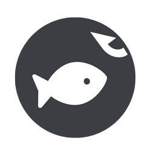

<p align="center">
  <a href="https://fishpi.cn">
    
  </a>
</p>

<h1 align="center">摸鱼派聊天室</h1>

基于摸鱼打工人社区——[摸鱼派](https://fishpi.cn)开放 API 开发而成，可以在里面愉快的吹水摸鱼。

## ✨ 功能

- 😎 基本聊天吹水；
- 💬 撤回消息；
- 📷 大图查看；
- 👉 @ 列表选择；
- 🎶 网易云音乐点歌播放列表；
- ⚙️ 丰富的自定义设置功能；

## 🛡 编译运行

``` bash
# 安装依赖
npm install

# 开发运行，网页将会挂靠在 localhost:9080
npm run dev

# 编译生成 electron 应用
npm run build

```

## 👀 界面

  
